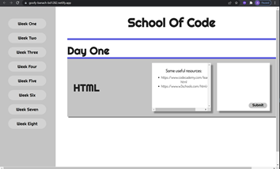
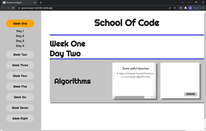

# Week 9 Project: The Boolean Hooligans Timetable

This project was created to address the issue of School of Code bootcampers feeling behind or wanting to be more prepared before formal teaching. The app allows bootcampers to look ahead at the topic lists for the weeks and access useful resoucres. Bootcampers themselves can also add resources they think will be useful for other bootcampers.

## Deployment

This project was deployed using netlify 

It can be accesssed here https://goofy-banach-bd1282.netlify.app/

## Tech Stack

**Client:** React

**Server:** Node, Express

## Screenshots

